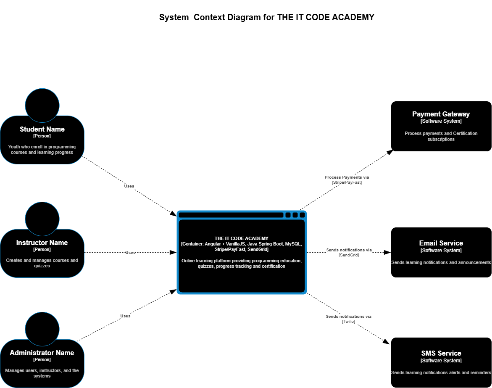
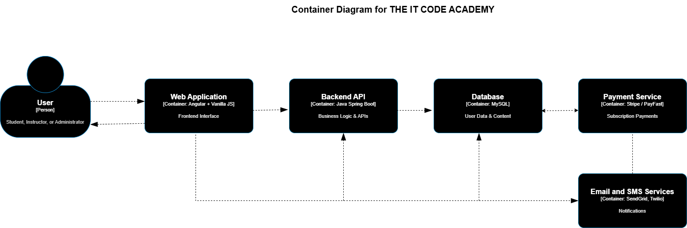
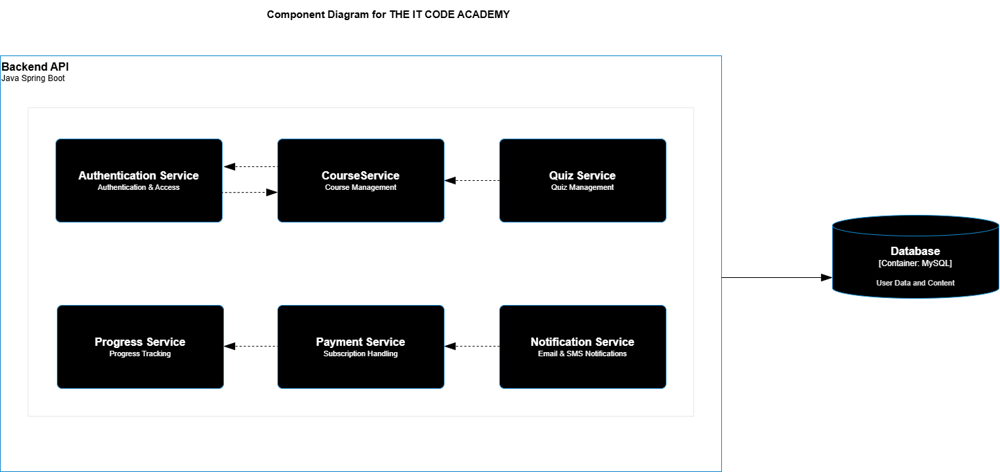

# System Architecture

## Project Title
THE IT CODE ACADEMY

---

## Domain
Education Technology (EdTech)

The system operates within the **Education Technology domain**, focusing on improving access to Information and Communication Technology (ICT) and programming education for youth in underserved communities.

The platform provides an **online learning environment** where students can access lessons, complete quizzes, track their learning progress, and obtain certifications. Instructors can create and manage courses, while administrators manage the system and users.

---

## Problem Statement
Youth in underserved communities often lack affordable access to quality ICT and programming education. Many available learning platforms require paid subscriptions, limiting access for disadvantaged learners.

**THE IT CODE ACADEMY** addresses this challenge by providing:

- Free access to programming lessons
- Optional paid certification
- Progress tracking for learners
- Course and quiz management for instructors
- Notifications for learning updates and reminders

The platform aims to provide **accessible, structured, and trackable learning opportunities** to empower students with digital skills.

---

## Individual Scope
This project models the **Minimum Viable Product (MVP)** architecture for THE IT CODE ACADEMY platform.

The system will include the following capabilities:

- User registration and authentication
- Course and lesson management
- Quiz and assessment system
- Student progress tracking
- Certification subscription payments
- Email and SMS notifications

The system will use **dummy data** to simulate:

- Users (students, instructors, administrators)
- Courses and lessons
- Quizzes and results
- Payment records

The architecture is designed using the **C4 Model**, which represents the system at multiple levels of abstraction:

1. System Context Diagram
2. Container Diagram
3. Component Diagram

---

# C4 Architecture Diagrams

## 1. System Context Diagram

The System Context Diagram shows how external users and external services interact with the system.

### Actors
- Student
- Instructor
- Administrator

### External Systems
- Payment Gateway (Stripe / PayFast)
- Email Service (SendGrid)
- SMS Service (Twilio)

### Diagram

---

## 2. Container Diagram

The Container Diagram shows the **major technology components** that make up the system and how they communicate.

### Containers

**Web Application**
- Technology: Angular + Vanilla JavaScript
- Provides the user interface for students, instructors, and administrators.

**Backend API**
- Technology: Java Spring Boot
- Handles authentication, business logic, course management, quizzes, payments, and notifications.

**Database**
- Technology: PostgreSQL / MySQL
- Stores users, courses, lessons, quizzes, progress records, and payments.

**Payment Service**
- External payment provider (Stripe / PayFast)
- Handles certification subscription payments.

**Notification Services**
- SendGrid for email notifications
- Twilio for SMS notifications

### Diagram

---

## 3. Component Diagram (Backend API)

The Component Diagram shows the **internal structure of the Backend API container**.

### Core Components

**AuthService**
- Handles user registration and login
- JWT authentication
- Role-based access control

**CourseService**
- Manages courses and lessons
- Handles course creation, updates, and retrieval

**QuizService**
- Manages quizzes and scoring
- Processes quiz submissions

**ProgressService**
- Tracks lesson completion
- Records quiz scores and learning progress

**PaymentService**
- Integrates with payment gateway
- Handles certification subscriptions

**NotificationService**
- Sends email notifications using SendGrid
- Sends SMS notifications using Twilio

### Diagram

---

# Summary

The architecture for **THE IT CODE ACADEMY** is designed using the **C4 Model** to clearly illustrate the system structure from a high-level overview down to internal components.

The system integrates:

- Web frontend for user interaction
- Backend API for business logic
- Database for persistent data storage
- External services for payments and notifications

This design ensures the platform is **scalable, modular, and maintainable**, allowing future expansion as the system evolves throughout the semester.
