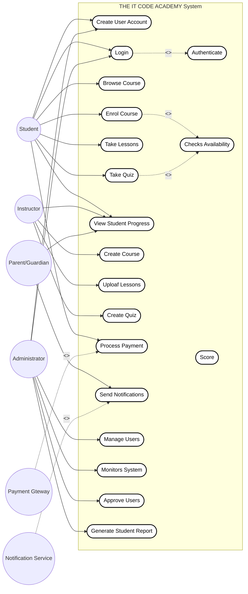
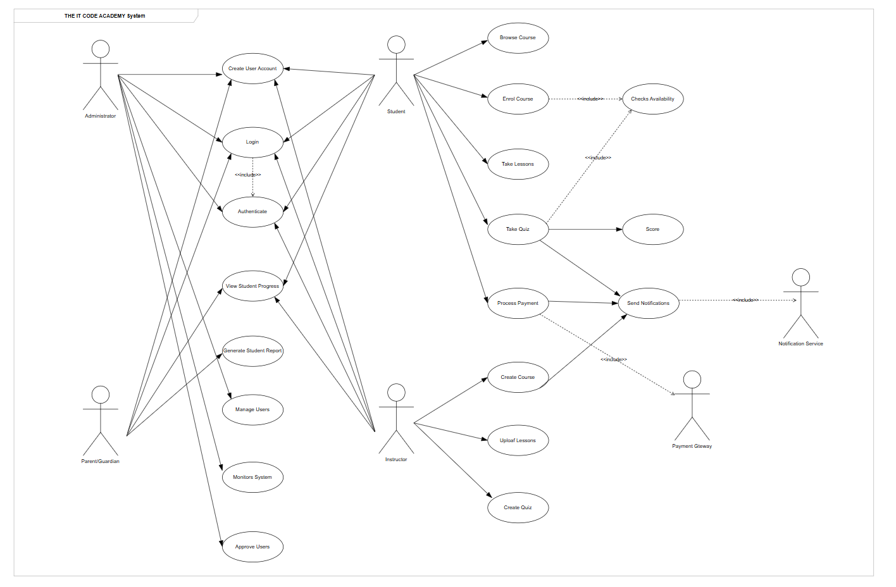

# Use Case Diagrams

### Mermaid 

```mermaid
graph LR
    %% =============================================
    %% ACTORS 
    %% =============================================
    Student((Student))
    Instructor((Instructor))
    Admin((Administrator))
    Parent((Parent/Guardian))
    PaymentGteway((Payment Gteway))
    NotificationService((Notification Service))

    %% =============================================
    %% SYSTEM BOUNDARY
    %% =============================================
    subgraph "THE IT CODE ACADEMY System"
        direction TB

        UC1([Create User Account])
        UC2([Login])
        UC3([Authenticate])
        UC4([Browse Course])
        UC5([Enrol Course])
        UC6([Take Lessons])
        UC7([Take Quiz])
        UC8([View Student Progress])
        UC9([Create Course])
        UC10([Uploaf Lessons])
        UC11([Create Quiz])
        UC12([Process Payment])
        UC13([Send Notifications])
        UC14([Manage Users])
        UC15([Monitors System])
        UC16([Approve Users])
        UC17([Generate Student Report])
        UC18([Checks Availability])
        UC19([Score])
    end

    %% =============================================
    %% RELATIONSHIPS
    %% =============================================
    %% Student interactions
    Student --> UC1
    Student --> UC2
    Student --> UC4
    Student --> UC5
    Student --> UC6
    Student --> UC7
    Student --> UC8
    Student --> UC12

    %% Instructor interactions
    Instructor --> UC9
    Instructor --> UC10
    Instructor --> UC11
    Instructor --> UC8

    %% Administrator interactions 
    Admin --> UC1
    Admin --> UC2
    Admin --> UC14
    Admin --> UC15
    Admin --> UC16
    Admin --> UC17

    %% Parent/Guardian interactions
    Parent --> UC8
    Parent --> UC13

    %% External services (exact <<include>> relationships)
    PaymentGteway -.->|<<include>>| UC12
    NotificationService -.->|<<include>>| UC13

    %% Internal <<include>> relationships 
    UC2 -.->|<<include>>| UC3
    UC5 -.->|<<include>>| UC18
    UC7 -.->|<<include>>| UC18

    %% STYLING
    classDef usecase fill:#ffffff,stroke:#000000,stroke-width:2px,color:#000000;
    class UC1,UC2,UC3,UC4,UC5,UC6,UC7,UC8,UC9,UC10,UC11,UC12,UC13,UC14,UC15,UC16,UC17,UC18,UC19 usecase

    classDef actor fill:#ffffff,stroke:#000000,stroke-width:2px,color:#000000;
    class Student,Instructor,Admin,Parent,PaymentGteway,NotificationService actorr

```

### Use Case Diagram Picture from Draw.io

---

### Use Case Diagram Drawio File

